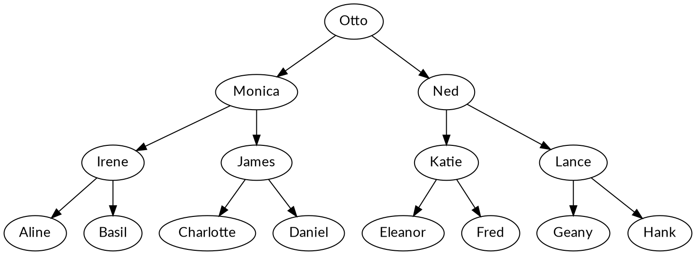

# Refactoring: Theorie

## Definition

> **Refactoring** (noun): a change made to the internal structure of software to
> make it easier to understand and cheaper to modify without changing its
> observable behavior.

> **Refactoring** (verb): to restructure software by applying a series of
> refactorings without changing its observable behavior.

Quelle: [_Refactoring. Improving the Design of Existing
Code_](https://www.informit.com/store/refactoring-improving-the-design-of-existing-code-9780134757599),
p. 45 (Martin Fowler, Kent Beck)

> **Refactoring** (Substantiv): eine Änderung der internen Struktur von
> Software, um diese einfacher verständlich und modifizierbar zu machen, ohne
> dabei ihr wahrnehmbares Verhalten zu verändern.

> **Refactoring** (Verb): Software restrukturieren, indem man eine Reihe von
> Refactorings vornimmt, ohne deren wahrnehmbares Verhalten zu verändern.

(Eigene Übersetzung)

## Gründe für das Refactoring

1. **Refactoring verbessert das Design von Software.** Die Struktur von
   Software, die laufend erweitert wird, verschlechtert sich mit der Zeit.
   Oftmals schleicht sich duplizierter Code ein. Dadurch wird die Software
   grösser, schwerer verständlich und aufwändiger anzupassen. Das Design der
   Software wird besser, wenn man duplizierten Code reduzieren kann.
2. **Refactoring macht die Software einfacher verständlich.** Der Compiler kann
   auch mit schwer verständlichem Code umgehen ‒ der Programmierer, der die
   Software warten muss, hat damit jedoch Mühe. Mit Refactoring kann man das
   Leben des nächsten Programmierers, der sich mit dem Code befassen muss,
   einfacher machen: Nach dem Refactoring ist der Code besser lesbar und dessen
   Absicht einfacher erkennbar.
3. **Refactoring hilft bei der Suche nach Fehlern.** In schlecht strukturiertem
   Code lassen sich Fehler nur schwer erkennen. Verbessert man die Struktur des
   Codes, kann man dabei Fehler erkennen: Einerseits im verbesserten Code,
   andererseits auch während des Refactoring-Vorgangs, da man sich hier
   gründlich mit dem Code befasst.
4. **Refactoring macht das Programmieren schneller.** Das Refactoring kostet
   zunächst Zeit. Diese Investition lohnt sich aber langfristig, da man Code
   anschliessend einfacher erweitern und anpassen kann. Qualität hat ihren
   Preis, lohnt sich aber langfristig immer.

Quelle: _Refactoring_-Buch (siehe oben), p. 47-50

## Vorgehen

Wie soll man beim Refactoring vorgehen?

1. **Ein Problem erkennen.** Sogenannte _Code Smells_ (siehe unten) sind ein
   Hinweis darauf, dass etwas mit dem Code nicht stimmt.
2. **Tests schreiben.** Bevor man sich an die Verbesserung des Codes macht,
   schreibt man Unit Tests, die das Verhalten des zu überarbeitenden Codes
   prüfen. Bestehen bereits Testfälle, macht man sich mit ihnen vertraut und
   führt sie aus.
3. **Refactoring anwenden.** Zu den verschiedenen _Code Smells_ gibt es
   verschiedene Lösungsansätze, sog. _Refactorings_. Diese können auf den Code
   angewendet werden.

Nach dem Refactoring hat man einerseits verbesserten Produktivcode, andererseits
eine aktuelle Testreihe, welche das korrekte Verhalten des verbesserten Codes
sicherstellt.

## Code Smells und Refactorings

**Achtung:** Es gibt nicht für jedes Problem ein Patentrezept. Sammeln Sie
Erfahrung durch Ausprobieren! Dank Unit Testing und Versionskontrolle kann dabei
nicht viel schief gehen.

Die Webseite [Refactoring Guru](https://refactoring.guru/) bietet einen guten,
englischsprachigen Überblick zum Thema:

- [Code Smells](https://refactoring.guru/refactoring/smells)
- [Refactorings](https://refactoring.guru/refactoring/techniques)

Wikipedia bietet eine gute Übersicht über verschiedene _Code Smells_:

- [Code Smell (en)](https://en.wikipedia.org/wiki/Code_smell)
- [Code Smell (de)](https://de.wikipedia.org/wiki/Code-Smell)

Die
[Web-Version](https://memberservices.informit.com/my_account/webedition/9780135425664/html/refact-list.html)
des _Refactoring_-Buches (siehe oben) enthält einen umfassenden Katalog von
Refactorings. Der Zugang ist jedoch kostenpflichtig, bzw. muss man im Besitz des
Buches sein, um Zugang zu erhalten.

# Refactoring: Aufgaben

Bei den folgenden Aufgaben soll nach dem folgenden Schema vorgegangen werden:

1. Den Code lesen und das Problem (_Code Smell_) erkennen
2. Unit Tests für den Code schreiben (oder lesen und evtl. erweitern)
3. Den Code anpassen (_Refactoring_ anwenden) und ihn dabei per Unit Test überprüfen

**Diese Aufgabenstellungen gilt für alle der folgenden Beispiele!**

Die oben verlinkten Code Smells und Refactorings können beim Lösen der Aufgaben
helfen. Vielleicht finden Sie aber selber Probleme und entsprechende Lösungen.

Sie können die Aufgaben in beliebiger Reihenfolge lösen. Erstellen Sie zuerst
einen Fork von diesem Repository.

Die Angaben zu Quellcodedateien beziehen sich auf die Unterverzeichnisse
`csharp` (C#) bzw. `python` (Python).

## C# (Unterverzeichnis `csharp`)

Stellen Sie sicher, dass Sie das .Net-SDK in Version 7 installiert haben! Falls Sie mit dem Terminal arbeiten, wechseln Sie jetzt in das Unterverzeichnis `csharp/`:

   cd csharp/

### Stammbaum

Bei dieser Aufgabe wird der folgende (unvollständige, da nur einen Elternteil
zeigende) Stammbaum abgebildet:

Die Aufgabe besteht aus den folgenden Dateien:

- `Refactoring/FamilyMember.cs` (Klasse `FamilyMember`)
- `Refactoring/Heritage.cs` (`Main()`-Methode)
- `Refactoring.Tests/FamilyMemberTest.cs` (Testfall)

Die Klasse `Heritage` definiert die Beziehungen zwischen den
Familienmitgliedern, indem jedem Familienmitglied eine Reihe von Kindern
(`children`) zugewiesen wird. (Die Beziehungen werden also von oben nach unten
modelliert.)

Die `Main()`-Methode lässt sich folgendermassen im Terminal ausführen:

	dotnet run --project Refactoring

Dadurch werden die Nachfahren von _Otto_ textuell ausgegeben:

    Monica is a descendant of Otto (generation 1)
            Irene is a descendant of Otto (generation 2)
                     Aline is a descendant of Otto (generation 3)
                     Basil is a descendant of Otto (generation 3)
            James is a descendant of Otto (generation 2)
                     Charlotte is a descendant of Otto (generation 3)
                     Daniel is a descendant of Otto (generation 3)
    Ned is a descendant of Otto (generation 1)
            Klara is a descendant of Otto (generation 2)
                     Eleanor is a descendant of Otto (generation 3)
                     Fred is a descendant of Otto (generation 3)
            Lance is a descendant of Otto (generation 2)
                     Geany is a descendant of Otto (generation 3)
                     Hank is a descendant of Otto (generation 3)

Die Klasse `FamilyMember` enthält eine Methode `GetDescendants`, welche ein
Dictionary zurückgibt (Key: Familienmitglied, Schlüssel: Nummerierung der
Generation).

Testfälle stehen in `Refactoring.Tests/FamilyMemberTest.cs` bereit. Sie können
bei Bedarf weitere Testfälle schreiben.

Konzentrieren Sie sich auf die Methode `GetDescendants`: Was ist hier schlecht
am Code? Und wie lässt sich das Problem beheben?

#### Zusatzaufgabe (freiwillig)

Schreiben Sie die Klasse `FamilyMember` (und wenn nötig: die `Main()`-Methode in
der Klasse `Heritage`) um, sodass die Beziehungen nicht mehr von den Eltern zu
den Kindern, sondern von den Kindern zu den Eltern gehen.

### Fibonacci-Zahlen

In der Klasse `Fibonacci` (`Refactoring/Fibonacci.cs`) gibt es eine Methode
namens `Fib()` mit einem entsprechenden Testfall
(`Refactoring.Tests/FibonacciTest.cs`). Die Testmethode `TestBigFibonacciNumber`
demonstriert, dass die rekursive Implementierung von `Fib()` sehr ineffizient
ist.

Schreiben Sie die Methode `Fib` um, sodass Sie immer noch funktioniert, aber
schneller durchläuft. Hierzu gibt es mehrere Möglichkeiten:

1. Strukturierte Implementierung mittels Schleife
2. Rekursive Implementierung mit Akkumulator-Parametern für die Zwischenergebnisse
3. Rekursive Implementierung mit einem Cache (_Memoization_)

### Währungsrechner

Die Klasse `CurrencyConverter` (`Refactoring/CurrencyConverter.cs`) enthält eine
Methode zur Umrechnung von Schweizer Franken (CHF) in einige andere Währungen
(USD, EUR, GBP, RUB).

Will man eine weitere Währung unterstützen, muss der Code erweitert werden.
Schöner wäre es, wenn man hierzu nur eine Datenstruktur reweitern müsste. Bauen
Sie die Methode `ConvertTo` entsprechend um.

Schreiben Sie Ihre Tests in `Refactoring.Tests/CurrencyConverterTest.cs`.

### Benotung

Die Klasse `Grading` (`Refactoring/Grading.cs`) besteht nur aus einer statischen
Methode namens `GetLetterGrade`. Diese übersetzt numerische Noten von 1 (beste)
bis 6 (schlechteste) in Buchstaben von A (beste) bis F (schlechteste).

Der Code kann wesentlich einfacher gestaltet werden, wenn man sich den Umstand
zunutze macht, dass sich die ASCII-Zeichen `A` bis `F` alle mit dem gleichen
Mechanismus in die Zahlen `1` bis `6` umrechnen lassen.

Schreiben Sie Ihre Tests in `Refactoring.Tests/GradingTest.cs`.

Falls Sie nicht wissen, wie der Code verbessert werden könnte, hilft vielleicht
ein Blick auf die
[ASCII-Tabelle](https://www.w3schools.com/charsets/ref_html_ascii.asp). (Auf
einem Unix-artigen System finden Sie diese mittels `man 7 ascii`)

### Zahlen runden

Die Klasse `Rounding` (`Refactoring/Rounding.cs`) ermöglicht mittels der Methode
`Round()` das Runden auf eine bestimmte Präzision.

Zwischen der Genauigkeit der Rundung (`Precision`) und den Werten, die in der
Berechnungsformel verwendet werden, besteht ein Zusammenhang. (Tipp: Will man
eine Zahl auf Hundertstel genau runden, kann man das Hundertfache der Zahl
runden und diese anschliessend durch hundert dividieren.) Vereinfachen Sie den
Code entsprechend.

Schreiben Sie Ihre Tests in `Refactoring.Tests/RoundingTest.cs`.

### Tierlaute

In diesem Beispiel gibt es mehrere Klassen:

- `Animal` (`Refactoring/Animals/Animal.cs`): ein abstraktes Tier
   - `Cow` (`Refactoring/Animals/Cow.cs`): eine Kuh
   - `Dog` (`Refactoring/Animals/Dog.cs`): ein Hund
   - `Horse` (`Refactoring/Animals/Horse.cs`): ein Pferd
- `Zoo` (`Refactoring/Animals/Zoo.cs`): eine Client-Klasse, welche die bisher
  genannten Klassen verwendet

Die Methode in `Zoo.MakeNoise()` ist nicht sinnvoll implementiert worden.
Verbessern Sie diese. Falls Sie das Problem am Code nicht sehen, überlegen Sie
sich am besten, was der Zweck von Polymorphie und Vererbung ist.

Schreiben Sie Ihre Tests für die Methode `Zoo.MakeNoise()` in
`Refactoring.Tests/ZooTest.cs`.

## Python (Unterverzeichnis `python`)

Stellen Sie sicher, dass Sie Python in einer aktuellen Version (3.11) mitsamt `pip` installiert haben. Wechseln Sie im Terminal ins Unterverzeichnis `python/`, wo Sie eine virtuelle Umgebung anlegen:

   cd python/
   python -m venv env

Aktivieren Sie die virtuelle Umgebung:

   . env/bin/activate       # Linux/Bash
   env/Scripts/activate     # Windows/Bash
   env/Scripts/Activate.ps1 # Windows/PowerShell

Installieren Sie `pytest`:

   pip install pytest

### Stammbaum

Bei dieser Aufgabe wird der folgende (unvollständige, da nur einen Elternteil
zeigende) Stammbaum abgebildet:

Die Aufgabe besteht aus den folgenden Dateien:

- `refactoring/family_member.py` (Klasse `FamilyMember`)
- `heritage.py` (ausführbares Programm)
- `tests/family_member_test.py` (Testfall)

Der Code in `heritage.py` definiert die Beziehungen zwischen den
Familienmitgliedern, indem jedem Familienmitglied eine Reihe von Kindern
(`children`) zugewiesen wird. (Die Beziehungen werden also von oben nach unten
modelliert.)

Das Programm lässt sich folgendermassen im Terminal ausführen:

   python refactoring/heritage.py

Dadurch werden die Nachfahren von _Otto_ textuell ausgegeben:

	 Monica is a descendant of Otto (generation 1)
		 Irene is a descendant of Otto (generation 2)
			 Aline is a descendant of Otto (generation 3)
			 Basil is a descendant of Otto (generation 3)
		 James is a descendant of Otto (generation 2)
			 Charlotte is a descendant of Otto (generation 3)
			 Daniel is a descendant of Otto (generation 3)
	 Ned is a descendant of Otto (generation 1)
		 Katie is a descendant of Otto (generation 2)
			 Eleanor is a descendant of Otto (generation 3)
			 Fred is a descendant of Otto (generation 3)
		 Lance is a descendant of Otto (generation 2)
			 Geany is a descendant of Otto (generation 3)
			 Hank is a descendant of Otto (generation 3)

Die Klasse `FamilyMember` enthält eine Methode `get_descendants`, welche ein
Dictionary zurückgibt (Key: Familienmitglied, Schlüssel: Nummerierung der
Generation).

Testfälle stehen in `tests/family_member_test.py` bereit. Sie können bei Bedarf
weitere Testfälle schreiben.

#### Zusatzaufgabe (freiwillig)

Schreiben Sie die Klasse `FamilyMember` (und wenn nötig: das Hauptprogramm in
`heritage.py`) um, sodass die Beziehungen nicht mehr von den Eltern zu den
Kindern, sondern von den Kindern zu den Eltern gehen.

### Fibonacci-Zahlen

Im Modul `fibonacci` (`refactoring/fibonacci.py`) gibt es eine Funktion namens
`fib()` mit einem entsprechenden Testfall (`tests/fibonacci_test.py`). Die
Testfunktion `test_big_fibonacci_number()` demonstriert, dass die rekursive
Implementierung von `fib()` sehr ineffizient ist.

Schreiben Sie die Funktion `fib()` um, sodass Sie immer noch funktioniert, aber
schneller durchläuft. Hierzu gibt es mehrere Möglichkeiten:

1. Strukturierte Implementierung mittels Schleife
2. Rekursive Implementierung mit Akkumulator-Parametern für die Zwischenergebnisse
3. Rekursive Implementierung mit einem Cache (_Memoization_)

### Währungsrechner

### Benotung

### Zahlen runden

### Tierlaute